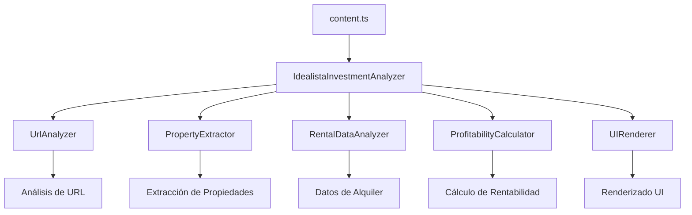

# Idealista Investment Analyzer 🏠💰

Una extensión de navegador que analiza automáticamente la rentabilidad de propiedades inmobiliarias en Idealista.com comparando precios de compra con potenciales ingresos por alquiler.

## ✨ Características

- 🎯 **Detección Automática**: Se activa automáticamente en páginas de búsqueda de Idealista
- 📊 **Análisis de Rentabilidad**: Calcula rentabilidad bruta y neta basada en datos reales de alquiler
- 💡 **Indicadores Visuales**: Muestra botones informativos con recomendación de inversión
- 📱 **Modal Detallado**: Información completa del análisis con un clic
- 🔄 **Análisis Cruzado**: Compara automáticamente precios de venta vs alquiler en la misma zona

## 🚀 Instalación

### Para Usuarios

1. Descarga la extensión desde Chrome Web Store (próximamente)
2. Navega a cualquier búsqueda de compra en Idealista.com
3. Los análisis de rentabilidad aparecerán automáticamente

### Para Desarrolladores

```bash
# Clonar repositorio
git clone https://github.com/tu-usuario/browser-extension-pisos.git
cd browser-extension-pisos

# Instalar dependencias
npm install

# Desarrollo
npm run dev chrome

# Build para producción
npm run build chrome
```

## 🏗️ Arquitectura de Código

La extensión sigue principios **SOLID** con una arquitectura modular y limpia:

### Estructura de Directorios

```
app/scripts/
├── domain/                    # Lógica de negocio
│   ├── interfaces.ts          # Contratos de interfaces
│   └── services/              # Servicios de dominio
│       ├── url-analyzer.ts          # Análisis de URLs de Idealista
│       ├── property-extractor.ts    # Extracción de datos de propiedades
│       ├── rental-data-analyzer.ts  # Análisis de datos de alquiler
│       ├── profitability-calculator.ts # Cálculos de rentabilidad
│       └── url-generator.ts         # Generación de URLs cruzadas
├── infrastructure/           # Servicios de infraestructura
│   └── logger.ts            # Sistema de logging
├── presentation/            # Capa de presentación
│   └── ui-renderer.ts      # Renderizado de interfaz
├── application/            # Coordinación de casos de uso
│   └── investment-analyzer.ts # Coordinador principal
└── content.ts             # Punto de entrada simplificado
```

### Principios SOLID Aplicados

#### 1. **Single Responsibility Principle (SRP)**

Cada clase tiene una única responsabilidad:

- **UrlAnalyzer**: Solo maneja análisis de URLs de Idealista
- **PropertyExtractor**: Solo extrae datos de propiedades del DOM
- **RentalDataAnalyzer**: Solo obtiene y analiza datos de alquiler
- **ProfitabilityCalculator**: Solo calcula rentabilidad
- **UIRenderer**: Solo maneja renderizado de la interfaz

#### 2. **Open/Closed Principle (OCP)**

- Todas las clases implementan interfaces, permitiendo extensión sin modificación
- Configuración inyectable en `ProfitabilityCalculator`

#### 3. **Liskov Substitution Principle (LSP)**

- Interfaces bien definidas permiten intercambiar implementaciones

#### 4. **Interface Segregation Principle (ISP)**

- Interfaces específicas por funcionalidad (`IUrlAnalyzer`, `IPropertyExtractor`, etc.)

#### 5. **Dependency Inversion Principle (DIP)**

- Dependencias inyectadas vía constructor
- Clases dependen de abstracciones (interfaces) no de implementaciones

### Flujo de Datos



## 📊 Funcionalidades Técnicas

### Análisis de URLs

- Detecta páginas de venta vs alquiler
- Extrae ubicación y filtros aplicados
- Valida que sea una página válida de Idealista

### Extracción de Datos

- Parsea propiedades del DOM de Idealista
- Extrae precio, habitaciones, m², ubicación
- Maneja diferentes layouts de resultados

### Cálculo de Rentabilidad

- **Rentabilidad Bruta**: `(Alquiler Anual / Precio Compra) × 100`
- **Rentabilidad Neta**: Resta gastos estimados:
  - Gestión inmobiliaria (9%)
  - Seguro (0.2% valor inmueble)
  - IBI (0.7% valor inmueble)
  - Gastos comunidad (40-80€/mes)
  - Vacancia y mantenimiento (5%)

### Recomendaciones

- **Excelente**: Rentabilidad neta ≥ 6%
- **Buena**: Rentabilidad neta ≥ 4%
- **Regular**: Rentabilidad neta ≥ 2%
- **Mala**: Rentabilidad neta < 2%

### Nivel de Riesgo

- **Alto**: Muestra pequeña < 3 propiedades o rentabilidad sospechosa
- **Medio**: Rentabilidad moderada
- **Bajo**: Rentabilidad realista (3-7% bruta)

## 🔧 Configuración y Personalización

### Variables de Configuración

El `ProfitabilityCalculator` acepta configuración personalizada:

```typescript
const config: ExpenseCalculationConfig = {
  propertyManagementRate: 0.09, // 9% gestión
  insuranceRate: 0.002, // 0.2% seguro
  propertyTaxRate: 0.007, // 0.7% IBI
  communityFeesWithGarage: 80, // 80€ gastos comunidad
  communityFeesWithoutGarage: 40, // 40€ gastos comunidad
  vacancyMaintenanceRate: 0.05, // 5% vacancia
};
```

## 🧪 Testing y Desarrollo

### Comandos Disponibles

```bash
# Desarrollo con hot reload
npm run dev chrome

# Build para producción
npm run build chrome

# Linting
npm run lint

# Generar iconos
npm run generate-icons
```

### Estructura de Testing

```bash
# Ejecutar tests (cuando estén implementados)
npm test

# Coverage
npm run test:coverage
```

## 🔒 Privacidad y Seguridad

- ✅ **No recopila datos personales**
- ✅ **Todas las peticiones son a Idealista.com**
- ✅ **No envía datos a servidores externos**
- ✅ **Procesamiento local en el navegador**
- ✅ **Rate limiting para respetar servidores**

## 🤝 Contribuir

1. Fork el proyecto
2. Crea una rama para tu feature (`git checkout -b feature/amazing-feature`)
3. Commit tus cambios (`git commit -m 'Add amazing feature'`)
4. Push a la rama (`git push origin feature/amazing-feature`)
5. Abre un Pull Request

### Estándares de Código

- Seguir principios SOLID
- Interfaces para todos los servicios
- Tests unitarios para nueva funcionalidad
- Documentación actualizada

## 📋 Roadmap

### ✅ Completado

- [x] Detección automática de páginas Idealista
- [x] Extracción de datos de propiedades
- [x] Análisis cruzado de rentabilidad
- [x] Interfaz de usuario con modales
- [x] Refactorización con arquitectura SOLID

### 🔄 En Progreso

- [ ] Sistema de caché de datos
- [ ] Panel de configuración de usuario
- [ ] Optimizaciones de rendimiento

### 📅 Futuro

- [ ] Testing integral
- [ ] Internacionalización
- [ ] Soporte para otros portales inmobiliarios
- [ ] Análisis de tendencias de mercado
- [ ] Exportación de datos

## 📄 Licencia

Este proyecto está bajo la Licencia MIT. Ver el archivo [LICENSE](LICENSE) para más detalles.

## 🙏 Reconocimientos

- Idealista.com por proporcionar datos inmobiliarios
- Comunidad de desarrollo web por herramientas y librerías
- Principios SOLID por Robert C. Martin

---

**Descargo de responsabilidad**: Esta extensión es una herramienta de análisis estimativo. Los cálculos son aproximados y no constituyen asesoramiento financiero profesional. Siempre consulte con expertos antes de realizar inversiones inmobiliarias.

