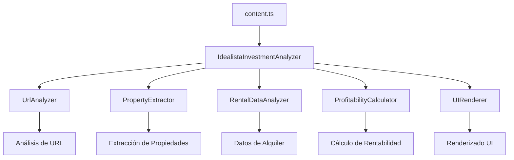

# Idealista Investment Analyzer 🏠💰

Una extensión de navegador que analiza automáticamente la rentabilidad de propiedades inmobiliarias en Idealista.com comparando precios de compra con potenciales ingresos por alquiler.

https://github.com/user-attachments/assets/652f5456-452d-4a7a-88d5-5948f5e4150c

## ✨ Características

- 🎯 **Detección Automática**: Se activa automáticamente en páginas de búsqueda de Idealista
- 📊 **Análisis de Rentabilidad**: Calcula rentabilidad bruta y neta basada en datos reales de alquiler
- 💡 **Indicadores Visuales**: Muestra botones informativos con recomendación de inversión
- 📱 **Modal Detallado**: Información completa del análisis con un clic
- 🔄 **Análisis Cruzado**: Compara automáticamente precios de venta vs alquiler en la misma zona
- ⚙️ **Panel de Configuración**: Personaliza gastos, umbrales de rentabilidad y opciones de visualización
- 🏦 **Cálculo con Hipoteca**: Incluye configuración de financiación e intereses
- 🌍 **Soporte Multiidioma**: Interfaz en Español e Inglés con selector de idioma

## 🚀 Instalación

### Para Usuarios

1. Descarga la extensión desde Chrome Web Store (próximamente)
2. Navega a cualquier búsqueda de compra en Idealista.com
3. Los análisis de rentabilidad aparecerán automáticamente

### Para Desarrolladores

```bash
# Clonar repositorio
git clone https://github.com/tu-usuario/browser-extension-pisos.git
cd browser-extension-pisos

# Instalar dependencias
npm install

# Desarrollo
npm run dev chrome

# Build para producción
npm run build chrome
```

## 🏗️ Arquitectura de Código

La extensión sigue principios **SOLID** con una arquitectura modular y limpia:

### Estructura de Directorios

```
app/scripts/
├── domain/                    # Lógica de negocio
│   ├── interfaces.ts          # Contratos de interfaces
│   └── services/              # Servicios de dominio
│       ├── url-analyzer.ts          # Análisis de URLs de Idealista
│       ├── property-extractor.ts    # Extracción de datos de propiedades
│       ├── rental-data-analyzer.ts  # Análisis de datos de alquiler
│       ├── profitability-calculator.ts # Cálculos de rentabilidad
│       ├── url-generator.ts         # Generación de URLs cruzadas
│       ├── cache-service.ts         # Sistema de caché con TTL
│       ├── config-service.ts        # Servicio de configuración de usuario
│       ├── error-handler.ts         # Manejo robusto de errores
│       ├── batch-processor.ts       # Procesamiento en lotes
│       ├── lazy-loader.ts           # Carga perezosa con Intersection Observer
│       ├── dom-optimizer.ts         # Optimización de manipulación DOM
│       ├── performance-monitor.ts   # Monitoreo de rendimiento
│       ├── language-service.ts      # Servicio de internacionalización
│       └── testing-validator.ts     # Validación y testing automático
├── infrastructure/           # Servicios de infraestructura
│   └── logger.ts            # Sistema de logging
├── presentation/            # Capa de presentación
│   └── ui-renderer.ts      # Renderizado de interfaz
├── application/            # Coordinación de casos de uso
│   └── investment-analyzer.ts # Coordinador principal
├── popup.ts               # Controlador del popup de configuración
└── content.ts             # Punto de entrada simplificado
```

### Principios SOLID Aplicados

#### 1. **Single Responsibility Principle (SRP)**

Cada clase tiene una única responsabilidad:

- **UrlAnalyzer**: Solo maneja análisis de URLs de Idealista
- **PropertyExtractor**: Solo extrae datos de propiedades del DOM
- **RentalDataAnalyzer**: Solo obtiene y analiza datos de alquiler
- **ProfitabilityCalculator**: Solo calcula rentabilidad
- **UIRenderer**: Solo maneja renderizado de la interfaz

#### 2. **Open/Closed Principle (OCP)**

- Todas las clases implementan interfaces, permitiendo extensión sin modificación
- Configuración inyectable en `ProfitabilityCalculator`

#### 3. **Liskov Substitution Principle (LSP)**

- Interfaces bien definidas permiten intercambiar implementaciones

#### 4. **Interface Segregation Principle (ISP)**

- Interfaces específicas por funcionalidad (`IUrlAnalyzer`, `IPropertyExtractor`, etc.)

#### 5. **Dependency Inversion Principle (DIP)**

- Dependencias inyectadas vía constructor
- Clases dependen de abstracciones (interfaces) no de implementaciones

### Flujo de Datos



## 📊 Funcionalidades Técnicas

### Análisis de URLs

- Detecta páginas de venta vs alquiler
- Extrae ubicación y filtros aplicados
- Valida que sea una página válida de Idealista

### Extracción de Datos

- Parsea propiedades del DOM de Idealista
- Extrae precio, habitaciones, m², ubicación
- Maneja diferentes layouts de resultados

### Sistema de Caché Inteligente

- **Caché con TTL**: Almacena datos de alquiler por 10 minutos
- **Agrupación de consultas**: Minimiza peticiones HTTP mediante batching
- **Limpieza automática**: Expira entradas obsoletas cada 5 minutos

### Optimizaciones de Rendimiento

- **Lazy Loading**: Análisis solo cuando las propiedades son visibles (Intersection Observer)
- **Batch Processing**: Agrupa propiedades similares para reducir peticiones
- **DOM Optimization**: Batching de operaciones DOM para minimizar reflows
- **Performance Monitoring**: Métricas de rendimiento en tiempo real

### Manejo Robusto de Errores

- **Retry con Exponential Backoff**: Reintenta automáticamente en fallos de red
- **Fallbacks Inteligentes**: Muestra información parcial cuando los datos no están disponibles
- **Logging Estructurado**: Sistema completo de logging para debugging

### Cálculo de Rentabilidad

- **Rentabilidad Bruta**: `(Alquiler Anual / Precio Compra) × 100`
- **Rentabilidad Neta**: Resta gastos estimados (configurables):
  - Gestión inmobiliaria (150€/mes por defecto)
  - Seguro (50€/mes por defecto)
  - IBI (100€/mes por defecto)
  - Gastos comunidad (60€/mes por defecto)
  - Vacancia (5% del alquiler por defecto)
  - Reparaciones y contingencias (1% del alquiler por defecto)

### Recomendaciones

- **Excelente**: Rentabilidad neta ≥ 6%
- **Buena**: Rentabilidad neta ≥ 4%
- **Regular**: Rentabilidad neta ≥ 2%
- **Mala**: Rentabilidad neta < 2%

### Nivel de Riesgo

- **Alto**: Muestra pequeña < 3 propiedades o rentabilidad sospechosa
- **Medio**: Rentabilidad moderada
- **Bajo**: Rentabilidad realista (3-7% bruta)

## 🔧 Configuración y Personalización

### Panel de Configuración de Usuario

La extensión incluye un popup de configuración accesible desde el icono de la extensión con las siguientes opciones:

#### **Gastos Estimados**
- **Gestión inmobiliaria**: Coste mensual fijo (€150 por defecto)
- **Seguro**: Coste mensual fijo (€50 por defecto)  
- **IBI**: Coste mensual fijo (€100 por defecto)
- **Comunidad**: Gastos de comunidad mensuales (€60 por defecto)
- **Vacancia**: % del alquiler para periodos sin inquilino (5% por defecto)
- **Reparaciones y contingencias**: % del alquiler para calentadores, averías, etc. (1% por defecto)

#### **Configuración de Hipoteca**
- **Financiación**: % del precio financiado (80% por defecto)
- **Interés**: TIN anual de la hipoteca (2.45% por defecto)
- **Gastos de gestión**: % del precio para notaría, registro, tasación (10% por defecto)

#### **Umbrales de Rentabilidad**
- **Excelente**: Rentabilidad neta mínima (6% por defecto)
- **Buena**: Rentabilidad neta mínima (4% por defecto) 
- **Regular**: Rentabilidad neta mínima (2% por defecto)

#### **Opciones de Visualización**
- **Mostrar indicadores**: Activar/desactivar badges de rentabilidad
- **Permitir modal**: Activar/desactivar modal de detalles
- **Estados de carga**: Mostrar/ocultar indicadores de carga

#### **Configuración de Idioma**
- **Selector de Idioma**: Cambio dinámico entre Español e Inglés
- **Persistencia**: El idioma seleccionado se mantiene entre sesiones
- **Detección Automática**: Idioma inicial basado en configuración del navegador
- **Fallback Inteligente**: Inglés por defecto para idiomas no soportados

### Configuración Programática

```typescript
const config: UserConfig = {
  expenseConfig: {
    propertyManagementMonthly: 150, // €/mes gestión
    insuranceMonthly: 50, // €/mes seguro  
    propertyTaxMonthly: 100, // €/mes IBI
    communityFees: 60, // €/mes comunidad
    vacancyMaintenanceRate: 0.05, // 5% vacancia
    maintenanceContingencyRate: 0.01, // 1% contingencias
  },
  mortgageConfig: {
    loanToValueRatio: 0.80, // 80% financiación
    interestRate: 2.45, // 2.45% TIN
    managementFeesRate: 0.10, // 10% gastos gestión
  },
  profitabilityThresholds: {
    excellent: 6, // 6% rentabilidad excelente
    good: 4, // 4% rentabilidad buena  
    fair: 2, // 2% rentabilidad regular
  },
  displayOptions: {
    showBadges: true,
    showModal: true,
    showLoadingStates: true,
  }
};
```

## 🧪 Testing y Desarrollo

### Comandos Disponibles

```bash
# Desarrollo con hot reload
npm run dev chrome

# Build para producción
npm run build chrome

# Linting
npm run lint

# Generar iconos
npm run generate-icons
```

### Estructura de Testing

```bash
# Ejecutar tests (cuando estén implementados)
npm test

# Coverage
npm run test:coverage
```

## 🔒 Privacidad y Seguridad

- ✅ **No recopila datos personales**
- ✅ **Todas las peticiones son a Idealista.com**
- ✅ **No envía datos a servidores externos**
- ✅ **Procesamiento local en el navegador**
- ✅ **Rate limiting para respetar servidores**

## 🤝 Contribuir

1. Fork el proyecto
2. Crea una rama para tu feature (`git checkout -b feature/amazing-feature`)
3. Commit tus cambios (`git commit -m 'Add amazing feature'`)
4. Push a la rama (`git push origin feature/amazing-feature`)
5. Abre un Pull Request

### Estándares de Código

- Seguir principios SOLID
- Interfaces para todos los servicios
- Tests unitarios para nueva funcionalidad
- Documentación actualizada

## 📋 Roadmap

### ✅ Completado

- [x] Detección automática de páginas Idealista
- [x] Extracción de datos de propiedades
- [x] Análisis cruzado de rentabilidad
- [x] Interfaz de usuario con modales
- [x] Refactorización con arquitectura SOLID
- [x] **Sistema de caché inteligente con TTL**
- [x] **Optimizaciones de rendimiento (Lazy Loading, Batch Processing)**
- [x] **Manejo robusto de errores con retry automático**
- [x] **Testing y validación automática**
- [x] **Monitoreo de rendimiento en tiempo real**
- [x] **Panel de configuración completo con popup**
- [x] **Configuración de hipoteca y gastos personalizables**
- [x] **Internacionalización completa con soporte para Español e Inglés**

### 🔄 En Progreso

- [ ] Mejoras de UX adicionales

### 📅 Futuro

- [ ] Soporte para otros portales inmobiliarios
- [ ] Análisis de tendencias de mercado
- [ ] Exportación de datos
- [ ] Análisis de ROI a largo plazo

## 📄 Licencia

Este proyecto está bajo la Licencia MIT. Ver el archivo [LICENSE](LICENSE) para más detalles.

## 🙏 Reconocimientos

- Idealista.com por proporcionar datos inmobiliarios
- Comunidad de desarrollo web por herramientas y librerías
- Principios SOLID por Robert C. Martin

---

**Descargo de responsabilidad**: Esta extensión es una herramienta de análisis estimativo. Los cálculos son aproximados y no constituyen asesoramiento financiero profesional. Siempre consulte con expertos antes de realizar inversiones inmobiliarias.

